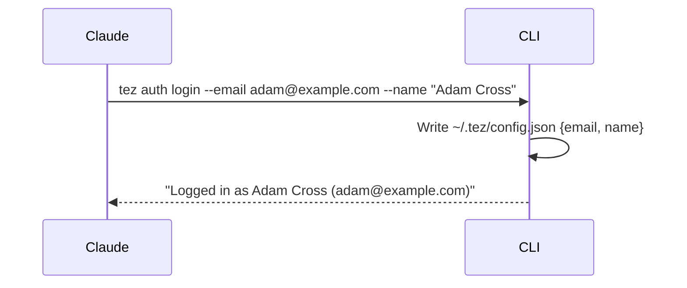
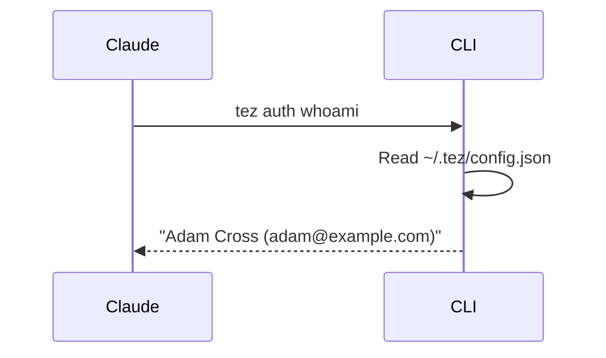
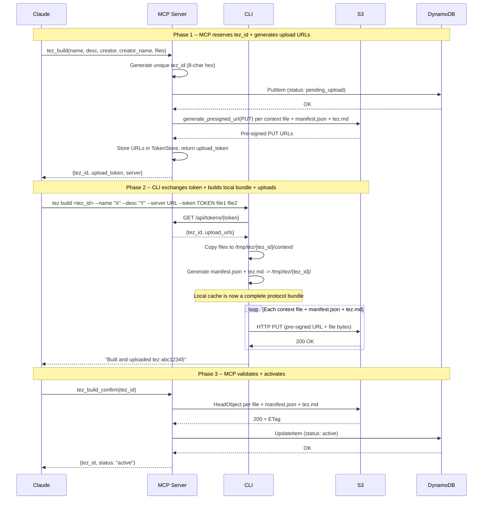
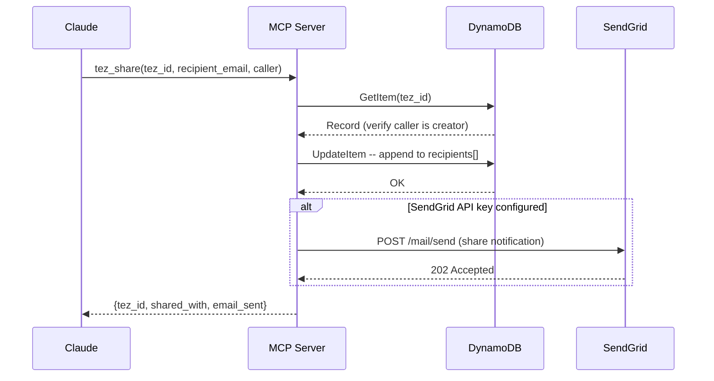
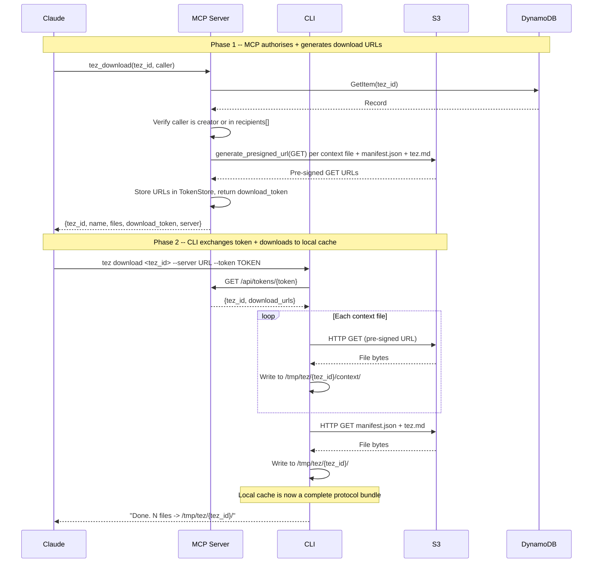
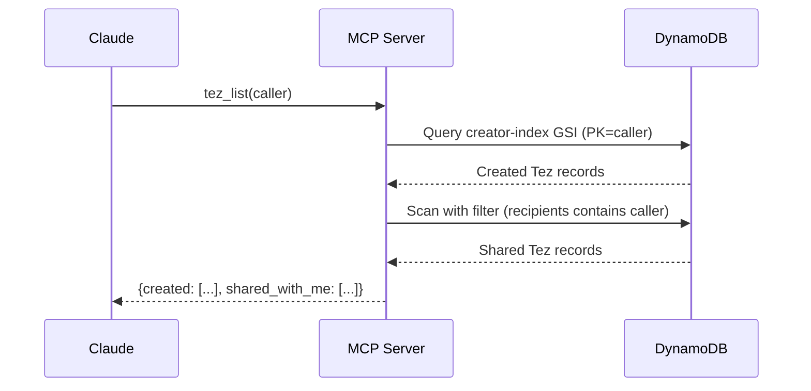
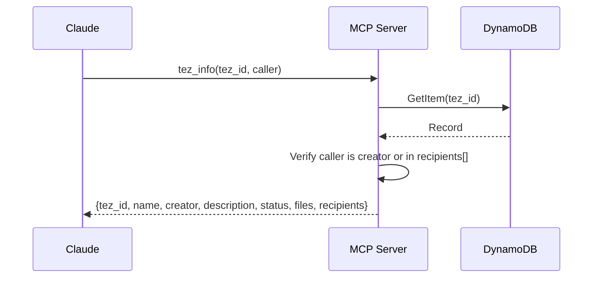
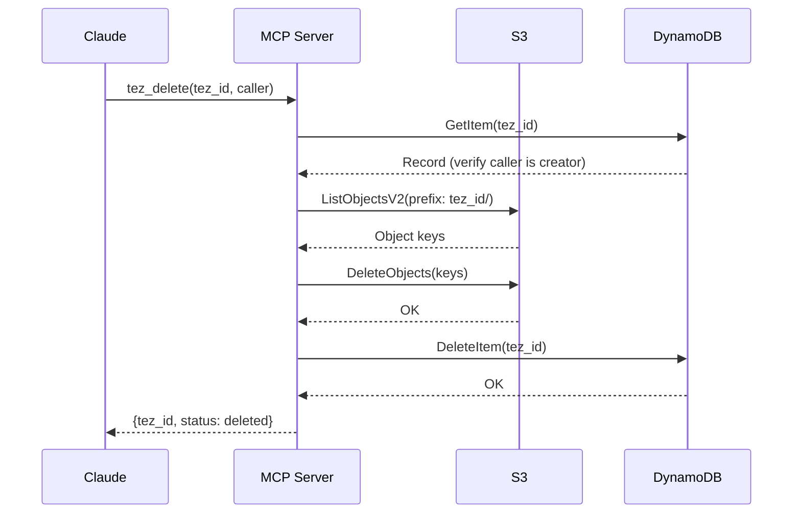
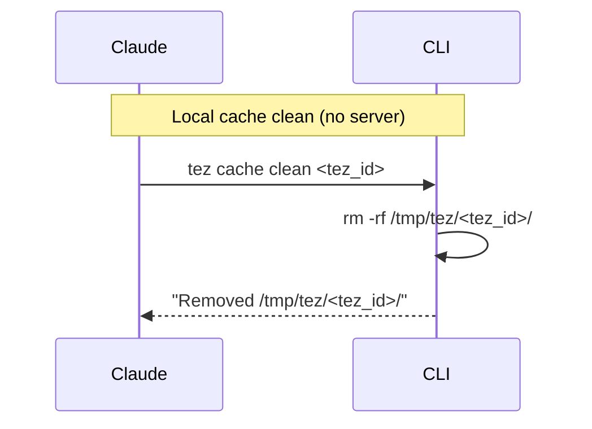
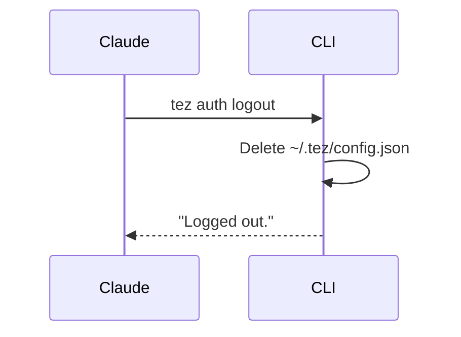

# Tez -- Data Flow Diagrams

All flows show the actors involved: **Claude** (orchestrator), **CLI** (local file I/O), **MCP** (server), **S3** (storage), **DynamoDB** (metadata).

The CLI exists only to augment what MCP cannot do -- file I/O and local config. Claude orchestrates all flows, calling MCP tools for data operations and CLI commands for local operations.

---

## 1. Login

> **Notes:** No server involvement. Identity is stored locally as a JSON file. No token exchange -- current implementation uses email-based trust. Name is required for share email notifications.

---

## 2. Whoami

> **Notes:** Pure local read. Exits with error if config file missing.

---

## 3. Build (Upload)

> **Notes:** Claude orchestrates the 3-phase flow across MCP and CLI. MCP owns all AWS operations (DynamoDB writes, pre-signed URL generation). The CLI exchanges a short-lived token for pre-signed URLs via `GET /api/tokens/{token}`, then builds the protocol bundle locally -- the creator has a usable local copy at `/tmp/tez/{tez_id}/` before anything hits S3. Then uploads via pre-signed URLs. Zero AWS credentials in the CLI.

---

## 4. Share

> **Notes:** MCP-only flow -- no CLI involvement. Updates DynamoDB recipients first, then optionally sends email. The recipient list is the source of truth for access control -- email is just a notification. Uses `creator_name` from the record for the email ("Adam shared this with you").

---

## 5. Download

> **Notes:** MCP handles authorisation and URL generation. The CLI exchanges a short-lived token for pre-signed URLs via `GET /api/tokens/{token}`, then downloads to `/tmp/tez/{tez_id}/` producing an identical local bundle to what `build` creates -- same protocol structure, same paths. Zero AWS credentials. Download URLs expire after 60 minutes.

---

## 6. List

> **Notes:** MCP-only flow. Uses a GSI (`creator-index`) for efficient "my Tez" queries. "Shared with me" uses a Scan with filter -- acceptable at scale, would benefit from a GSI at higher scale.

---

## 7. Info

> **Notes:** MCP-only flow. Returns metadata only -- no pre-signed URLs, no S3 interaction. Lighter weight than download for when Claude just needs to understand what a Tez contains.

---

## 8. Delete

> **Notes:** Two levels of delete. `tez_delete` (MCP) permanently removes the Tez from S3 and DynamoDB -- creator only. `tez cache clean` (CLI) just removes locally downloaded files -- no auth needed.

---

## 9. Logout

> **Notes:** Pure local operation. Removes the config file. No server-side session to invalidate.

---

## Responsibility Summary

| Actor | Responsibilities |
|-------|-----------------|
| **Claude** | Orchestrates all flows. Calls MCP tools first (for IDs, URLs, metadata), then CLI for file I/O. |
| **CLI** | Local file I/O only -- build local protocol bundles, upload/download via pre-signed URLs, local auth (`~/.tez/config.json`), cache cleanup. Zero AWS credentials. |
| **MCP Server** | All AWS operations -- metadata CRUD, authorisation checks, pre-signed URL generation (upload + download), email notifications, S3 delete. Never touches file bytes. |
| **S3** | File storage (one folder per Tez). Serves uploads/downloads via pre-signed URLs. Versioning enabled. |
| **DynamoDB** | Metadata store -- ownership, recipients, status, file lists. GSI for creator queries. Source of truth for access control. |
